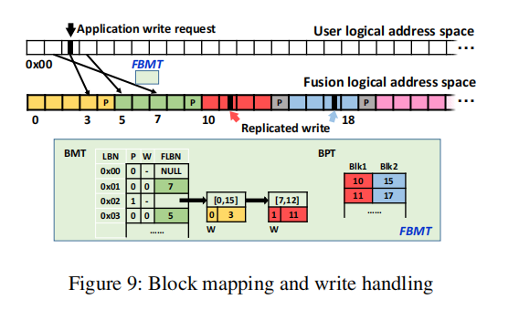

最新版记录，修正了第一版的错误<br>
第一版认为raid和rp应该独立，这个观点应该是错误的
<br>

<br>
目前的观点来看，rp应该在raid中，raid分配strip需要写P,复制写不需要如图，将P留出来便于以后的转换。
<br>所以复制写和raid_stripe的数据结构基本一致，只是在进行复制写的时候分配两个stripe写入。
<br>在进行转换时，删去一个stripe，并计算P。

# 接口
## is_large()
```c
5818行
函数判断给定的bio是small 或者是 large 读写
如果是large则忽略，进行raid读写
否则进行rp读写 给个is_small标志

以后在make_request所有if判断都要加上is_small 判断
```

## 


# 逻辑

## 状态 （未写）
尽管rp也分配raid的stripe_head，需要不同的状态

## 分配stripe_head的逻辑
```
5891行 
对于small write 分配两个 raid_stripe
该处逻辑就是对于offset分配连续两个stripe_head
```
## 分配好stripe_head之后的处理
```
5651行
release_stripe_plug
```
# Q
```
1. is_large后设置is_small 标志为1，不是全局应该不用加锁
```


# 未完成需要注意

1. stripe_head应该在内存中应该是连续的 元数据+dev 假设一次复制写写了两个head，接下来bio要写多分配的那个head，我的映射方法不应该像原来一样，需要依据map表
2. rp的lru和hash应该和raid一样吗？或者说raid的lru和hash是干什么的